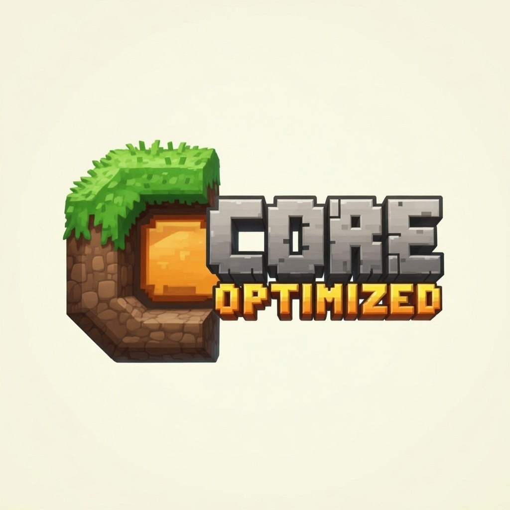

# Core Optimized

**A Vanilla-like Minecraft modpack focused on maximum performance and smart Quality-of-Life improvements, with active development and frequent updates.**

---

## What is Core Optimized?

**Core Optimized** is a carefully curated Minecraft modpack designed to feel **as close to vanilla as possible**, while significantly improving **Performance**, **Stability** and **Quality of Life**. No tech trees, no magic systems, no forced progression — just **Minecraft, but smoother and smarter**.

## Installation

The modpack is officially available on **CurseForge** and **Modrinth**.
### Supported Launchers
- CurseForge Launcher  
- Modrinth Launcher  
- Prism Launcher  
- ATLauncher  

Simply search for **Core Optimized** in your preferred launcher and install.

For detailed instructions, please visit the [Wiki](https://coreoptimized.readthedocs.io/en/latest/installation/).

## Included Mods

- **Performance Mods**  
  Optimizations for rendering, entities, memory, and game logic.

- **Quality of Life Mods**  
  Subtle enhancements that improve the experience without breaking vanilla balance.

- **Resource Packs**  
  Lightweight visual improvements with zero performance compromise.

## Recent Updates

- Modpack is live now on [Curseforge](https://www.curseforge.com/minecraft/modpacks/core-optimized-by-sniperxjohn)
- Wiki page is live: [Wiki](https://coreoptimized.readthedocs.io/en/latest/)
- Discord Server is also Live: [Discord](https://discord.gg/qWc7c6tZPP)
- The licensing has been changed to MIT to provide greater freedom to the community.
- Replaced *Enhanced Block Entities* with **Better Block Entities**

## Roadmap

- Main menu UI refresh
- Releases for **Minecraft 1.20.4** and **1.18.2**
- New versioning format starting from **Minecraft v26.1**

## Contributing

Contributions are **always welcome** — whether it’s:

- Bug reports
- Performance suggestions
- Documentation improvements
- Mod recommendations

Please read:
- `CONTRIBUTING.md`
- `CODE_OF_CONDUCT.md`

before getting started.

## Authors

- [@abhixops](https://www.github.com/abhixops)

## License

[MIT](LICENSE)
